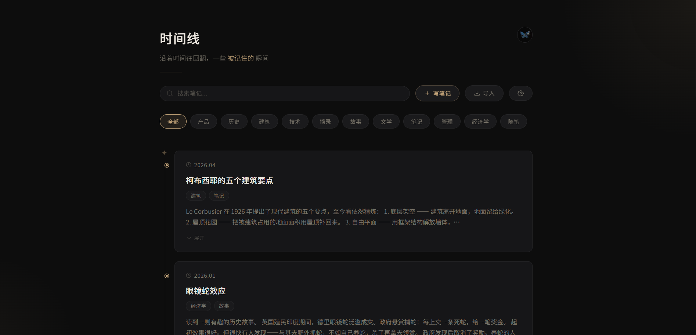

# 时间线 · Timeline

> 一个沿着时间往回翻的个人笔记工具。



---

## 它是什么

时间线是一个**纯前端、零依赖**的个人笔记应用。一个 HTML 文件，打开即用。

它用时间线来组织笔记——不是文件夹树，不是标签云，而是一条向后的时间轴。每一篇笔记是轴上的一点，日期在先，内容在后。

### 为什么是时间线

笔记工具很多，但大多数围绕着"分类"和"检索"来设计。时间线换了一个角度：**不问你记了什么，只问你什么时候记的。**

回头看时，重要的不是某个时刻你知道了什么，而是不同时刻之间——从不同角度看同一件事——那种微妙的偏移和深化。时间线把这个过程视觉化了。

---

## 功能

- **时间线浏览** —— 纵向时间轴，按日期倒序排列，Markdown 全文渲染
- **写笔记** —— 标题、日期、标签、正文，保存即刷新
- **编辑 / 删除** —— 每篇笔记可修改或移除
- **搜索** —— 实时搜索标题、正文和标签
- **标签筛选** —— 多选标签，联动搜索
- **导入 Markdown 文件** —— 支持 YAML frontmatter 解析，也支持纯文本
- **导出** —— 导出全部笔记为 JSON（可恢复备份）或 Markdown（可读）；单篇也可导出
- **多用户** —— 每个用户独立的笔记空间
- **用户管理** —— 添加 / 删除用户，修改显示名称、头像、密码
- **多主题** —— 5 套配色（暗金 / 深蓝 / 森林 / 石板 / 暖白）
- **数据持久化** —— 所有笔记存储在浏览器的 localStorage
- **键盘快捷键** —— `Ctrl+K` 搜索、`n` 写笔记、`Esc` 关闭弹窗

---

## 快速开始

1. 下载 `timeline.html`
2. 用浏览器打开
3. 注册一个用户
4. 开始写笔记

不需要安装任何东西，不需要服务器，不需要网络（首次加载 marked.js 库后离线可用）。

### 导入已有笔记

支持 Markdown 文件（`.md`），有两种格式：

**带 YAML frontmatter（推荐）**
```markdown
---
title: 笔记标题
date: 2025.03
tags: [日常, 阅读]
---

笔记内容...
```

**纯文本**
```markdown
# 标题

内容...
```

没有 frontmatter 时，自动用文件名作为标题，从文件名提取日期，文件的修改时间作为兜底。

---

## 数据安全

**这是一个纯前端本地应用。没有后端，没有服务器，没有云同步。**

- 所有数据存储在浏览器的 **localStorage** 中
- 不会被发送到任何服务器
- 密码通过 SHA-256（或 JS 备选哈希）在客户端存储，仅用于基础防误触保护
- **请勿用于存储高度敏感的信息**

如需备份，使用设置面板中的「导出 JSON」功能。

---

## 主题

| 主题 | 风格 |
|------|------|
| 暗金 | 默认，暖金暗色 |
| 深蓝 | 冷色调暗色，蓝色强调 |
| 森林 | 墨绿暗色，绿意强调 |
| 石板 | 中性灰，低饱和度暖灰强调 |
| 暖白 | 浅色模式，暖棕强调 |

主题在设置面板中切换，每个用户独立保存偏好。

---

## 技术

- 单 HTML 文件（CSS + JS 全嵌入）
- 纯浏览器端运行
- [marked.js](https://marked.js.org/) 用于 Markdown 渲染
- Web Crypto API（SHA-256）用于密码哈希，降级方案兼容 `file://` 协议
- 数据存储：localStorage

---

## 版本迭代

详见 [TIMELINE_CHANGELOG.md](TIMELINE_CHANGELOG.md)

共 7 个版本，从一条时间线到完整的个人笔记系统。

---

## License

MIT
